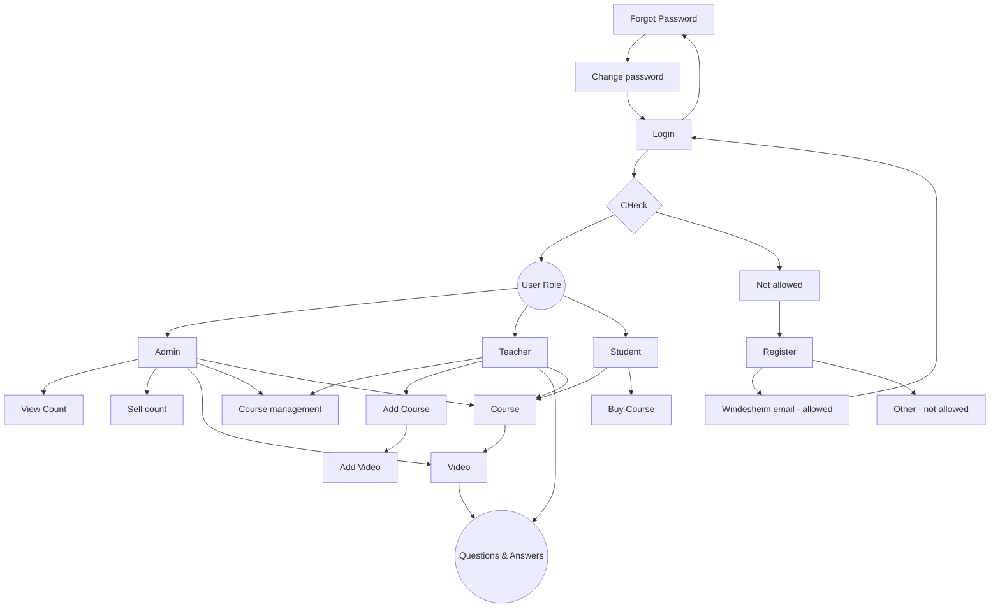

# Flow Chart

Flow chart for WFFLIX

## Mermaid

```mermaid

    
    
graph TD 
        A[Login] --> B{CHeck} --> C((User Role)) 
        A --> 1[Forgot Password]
        1 --> 2[Change password] -->A
        C --> D[Admin] 
        C --> E[Teacher]
        C --> F[Student]
        B --> G[Not allowed]
        G --> J[Register]
        J --> K[Windesheim email - allowed]--> A
        J --> L[Other - not allowed] 
        D --> H[View Count]
        D--> 5[Sell count]
        D --> N[Password Management]
        D --> I[Course management]
        E --> I
        E-->3[Add Course]--> 4[Add Video]
        F --> M[Course] --> N[Video] -->I2((Questions & Answers))
        F--> 6[Buy Course]
        E-->I2
        E --> M
        D --> M
```
